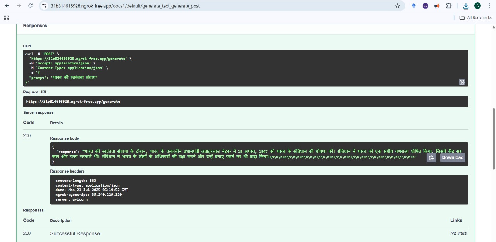

# 🧠 Airavata Quantization with FastAPI

This project showcases the quantization of the [`Ai4Bharat/Airavata`](https://huggingface.co/Ai4Bharat/Airavata) large language model and serves it using a FastAPI backend. The objective is to reduce model size and improve inference speed (latency and throughput) — making it more efficient for real-world applications.

> ⚠️ **Note:** Due to local hardware limitations, CPU-based quantization and serving were not tested. All performance evaluations were conducted on a GPU-enabled environment.

## 📷 Screenshot of API Response:

## 📈 Performance Comparison
Latency and throughput measured using the `test/benchmark.py` script:

| Metric            | Pre-Quantization (Estimated) | Post-Quantization (Measured) |
|-------------------|-------------------------------|-------------------------------|
| **Latency**       | ~13.2 sec                     | **8.26 sec**                  |
| **Throughput**    | ~0.07 req/sec                 | **0.12 req/sec**              |
| **Model Size**    | ~13B+ parameters              | **Reduced via 4-bit quant.**  |
| **Environment**   | GPU (Google Colab)            | GPU (Google Colab)            |

> 💡 **Note:** Due to local hardware limitations, CPU quantization and inference were not tested. All benchmarks were conducted using GPU (T4) on Google Colab.

## 👩‍💻 Author

**Aasika ES**  
M.Sc. Data Science Graduate  
📧 [aasikasivaji@gmail.com]

